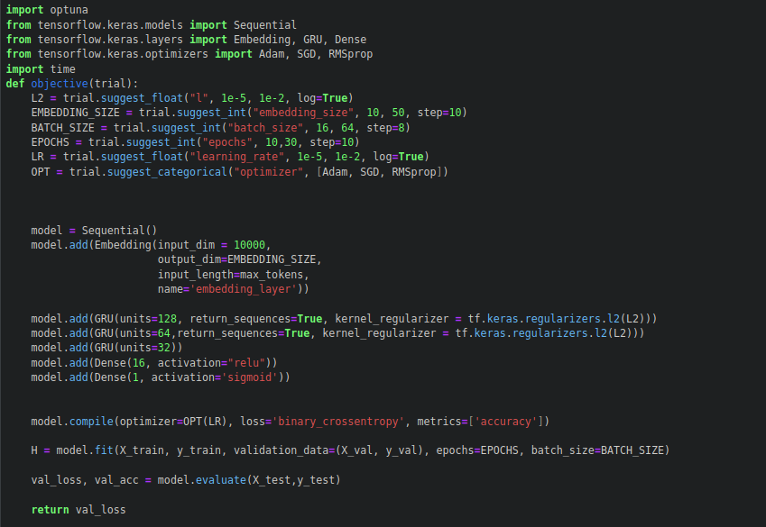
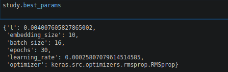
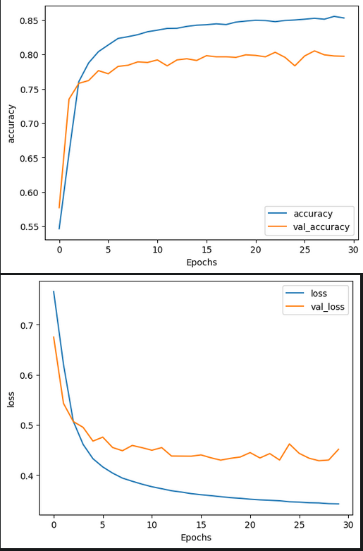
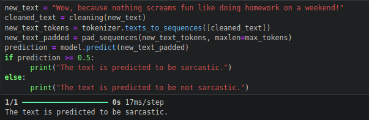

# Sarcasm detection
Just a sarcasm detection system that detects the sarcasm using GRU(Gated recurrent unit)

### Pros
- Has good accuracy score (85%)
- Used optuna to find the best possible parameters
- Trained in 28k dataset

### Cons
- Needs Gpu to process faster

# Installation
1. To run in local 

        1. `` pip install -r requirements.txt ``
        2. ``jupyter notebook sarcasm_detection.ipynb``

# Description
1. Use of optuna to find best possible parameter
   - [ Do not run this part ]

3. Using best possible parameters

4. Accuracy of the model

5. Prediction using the model

